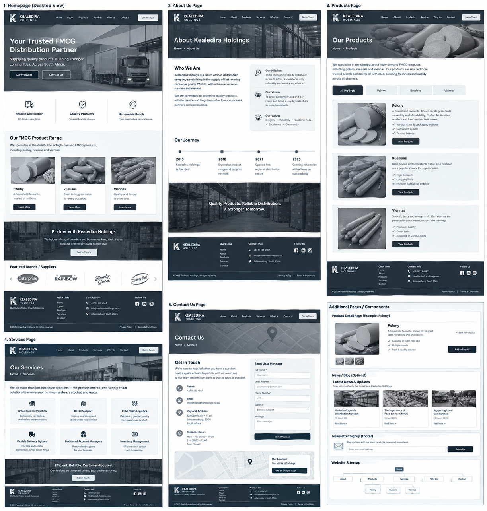
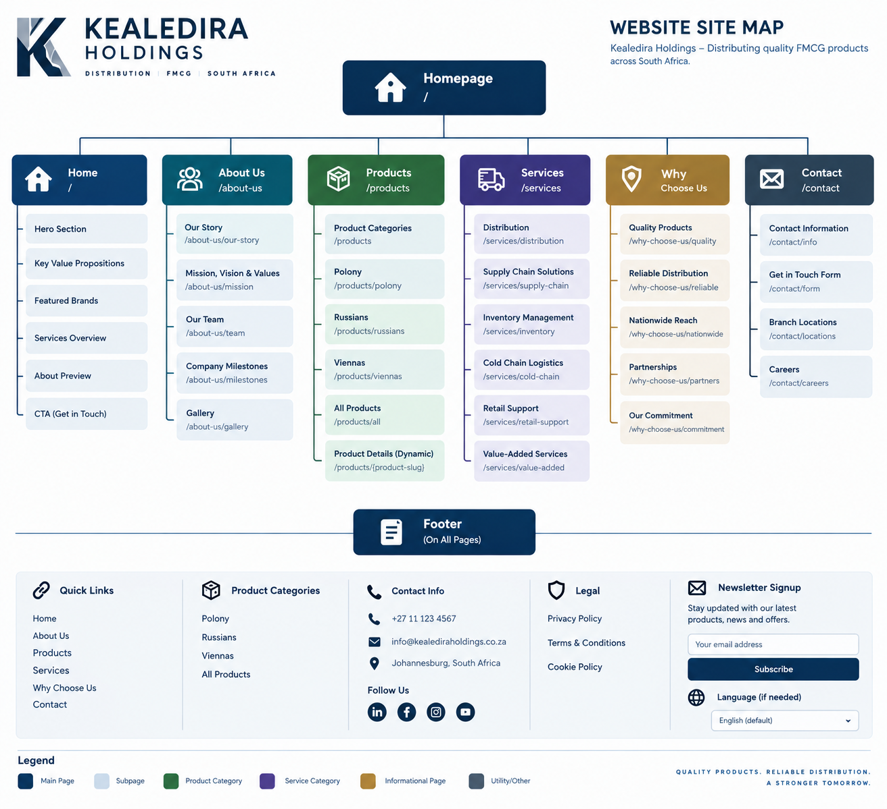
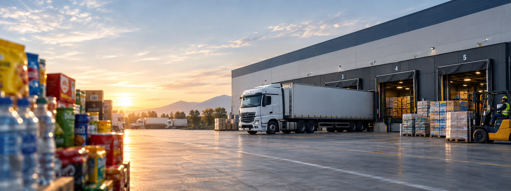
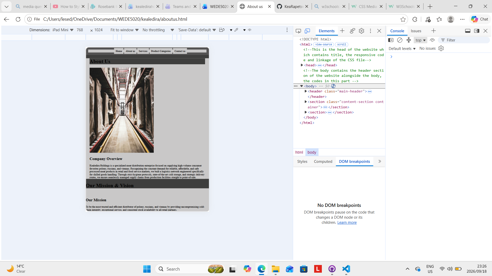
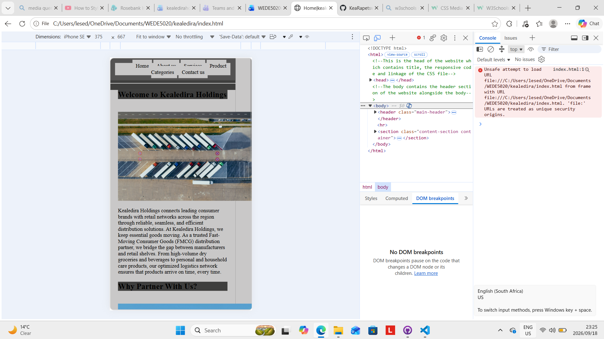

# kealedira
Organisational Overview. 

Kealedira Holdings is an FMCG business specialising in Bulk-breaking and Distribution of 	fast-moving consumer products. The business was established to provide reliable access 	to quality consumer products to businesses and retailers. Its mission is to deliver reliable, 	affordable , and efficient FMCG distribution services while building strong customer 	relationships. Its vision is to become a trusted and leading distribution partner in South 	Africa. The businesses target audience includes Retailers, Small Businesses, Wholesalers 	and Supermarkets, Kealedira Holdings aims to support these customers through 	convenient supply and dependable distribution services. 

 

Website Goals and Objectives. 

The website will increase Kealedira Holdings’ online visibility, attract potential B2B customers, and generate qualified leads. Objectives include increasing traffic through SEO and social media, encouraging quote requests, and improving visitor-to-lead conversion. Key KPIs include: 

500–1,000 monthly visitors. 

20–30 qualified leads per month. 

3–5% conversion rate. 

First-page rankings for targeted FMCG keywords, and 99% website uptime. 

Google Analytics and Search Console will monitor traffic, engagement, rankings, enquiries, and conversions, with monthly performance reviews used to improve results. 

 

Proposed Website Features and Functionability 

Essential Features 

Home Page: Overview of Kealedira Holdings and its FMCG services. 

About Us: Company history, mission, vision, and values. 

Products: Display of FMCG product categories. 

Services: Information on bulk breaking and distribution. 

Contact Page: Phone, email, and business hours. 

Responsive Design: Compatible with mobile, tablet, and desktop devices. 

Desired Functionality 

The website should provide easy navigation, fast loading, clear calls-to-action, and 	search-engine-friendly content. It should allow administrators to 	update products and 	company information easily. Integration with Google Maps, 	WhatsApp, Google 	Analytics, and social media is desirable to improve customer 	communication, 	traffic monitoring, and lead generation. 

Design and User Experience 

Overall Design Direction 

The Kealedira website should communicate a clear brand personality while making 	it easy 	for visitors to understand what the organisation offers and what action they 	should take 	next. 

The design should follow a clean, contemporary, and visually focused approach, using 	generous spacing, strong typography, and a restrained colour palette. The interface 	should 	avoid overcrowding and establish a clear visual hierarchy between headings, supporting 	information, imagery, and calls to action. 

Colour Scheme 

Colour 

Charcoal for headings, navigation and footer 

Warm White for Background 

Soft grey for Secondary Background 

Technical Requirements 

Technical Requirements 

Domain: Register a suitable domain such as kealedira.co.za or kealedira.com, depending on availability and target audience.  

Hosting: Use reliable cloud or shared hosting with SSL/HTTPS, regular backups, sufficient storage and good server uptime.  

Programming languages: HTML5 for structure, CSS3 for styling and responsive design, and JavaScript for interactive features.  

Framework: React or Next.js can be used for a modern, responsive interface. For a simpler website, HTML, CSS and JavaScript may be sufficient.  

Database: A database such as MySQL or PostgreSQL is only required if the website stores user accounts, enquiries, products or other dynamic information.  

Security: SSL certification, secure forms, strong authentication where necessary, spam protection and regular software updates.  

Responsive design: The website must work effectively on desktops, tablets and smartphones.  

Content management: A CMS such as WordPress could be included to allow non-technical users to update content easily 

 

 

Wireframes 

 

 

 

Timeline and Milestones 

Phase 

Timeline 

Activities 

Key Milestone 

Phase 1: Research & HTML 

Weeks 1–3 

Research Kealedira, identify user requirements, plan the website structure, create wireframes and develop the basic HTML pages 

Functional HTML website completed 

Phase 2: CSS & Design 

Weeks 4–6 

Create the colour scheme, typography, layouts and responsive styling. Apply CSS to the HTML pages and improve the overall user experience. 

Fully styled and responsive website completed 

Phase 3: SEO Integration 

Weeks 7–8 

Add page titles, meta descriptions, keywords, headings, alt text, descriptive URLs and other SEO improvements. Test performance and accessibility. 

SEO-optimised website ready for submission 

 

 

Sitemap 

 

 

Budget 

Recommended Project Budget 

This student-level five-page website would cost approximately R7000–R16,000. 

This would cover: 

5 responsive web pages  

HTML and CSS development  

Basic JavaScript if required  

SEO integration  

Domain and hosting  

Basic testing and optimisation  

Final documentation 

 

 

 

Item 

Estimated Cost (ZAR) 

Domain registration 

R150 – R300/year 

Web hosting 

R600 – R1,500/year 

SSL certificate 

R0 – R500/year 

Website design & wireframes 

R1,500 – R3,000 

HTML development 

R2,000 – R4,000 

CSS styling & responsive design 

R2,000 – R4,000 

SEO implementation 

R1,000 – R2,500 

Testing & final optimisation 

R500 – R1,000 

Estimated Total 

R7,750 – R16,800 

Screenshot evidence

 

References 

Kealedira Holdings 2026, Polony, Russian & Vienna Wholesale Distribution, Kealedira Holdings. 

Unsplash.com/images 

Pixabay.com/photos 